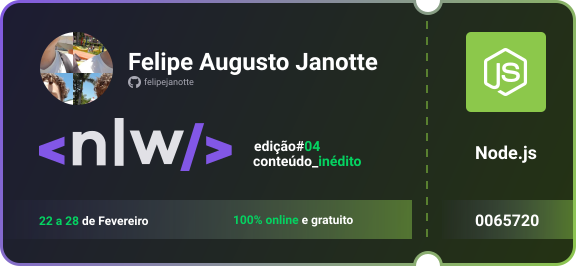

<h1 align="center">
    
</h1>

<h2 align="center">
	Rumo ao próximo nível
</h2>
<p>
	Neste NLW nós podíamos escolher entre 3 trilhas: 
	<ul>
		<li><strong>React (Instrutor: <a href="https://github.com/diego3g" target="_blank">Diego Fernandes</a>)</strong></li>
		<li><strong>Node.js (Instrutora: <a href="https://github.com/danileao" taget="_blank">Daniele Evangelista</a>)</strong></li>
		<li><strong>Elixir (Instrutor: <a href="https://github.com/RafaelCamarda" target="_blank">Rafael Camarda</a>)</strong></li>
	</ul>
</p>
<p>
	Eu segui pela trilha de <strong>Node.js</strong> e estaremos fazendo um sistema de avaliação do cliente NPS (Net Promoter Score).
</p>

<h4>
	Dependências
</h4>


```shell
NPM
	npm install express --save
	npm install typeorm --save
	npm install reflect-metadata --save
	npm install sqlite3 --save
	npm install uuid
YARN
	yarn add express
	yarn add typeorm
	yarn add reflect-metadata
	yarn add sqlite3
	yarn add uuid
```

<h4>
	Dependências de Desenvolvimento
</h4>


```shell
NPM
	npm install @types/express --save-dev
	npm install typescript --save-dev
	npm install ts-node-dev --save-dev
	npm install @types/uuid --save-dev
YARN
	yarn add @types/express -D
	yarn add typescript -D
	yarn add ts-node-dev -D
	yarn add @types/uuid -D
```
